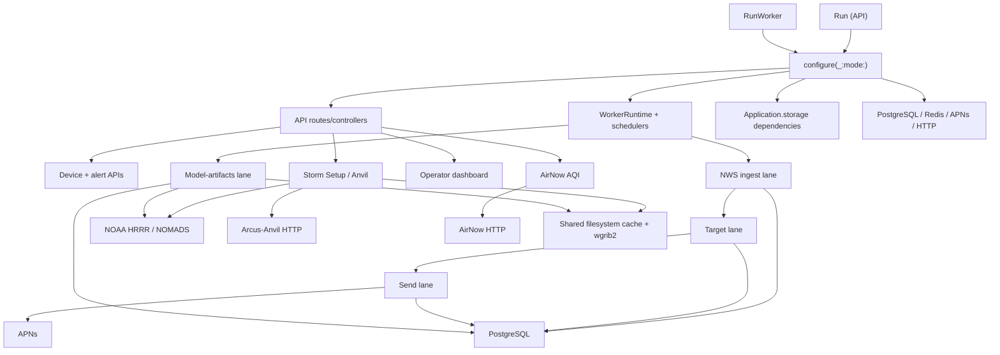

# Arcus Signal Architecture Recovery Audit

**Audit date:** 2026-07-28

**Repository:** `justinrooks/arcus-signal`

**Audited ref:** `main` at `254728f` (`Filter notification candidates by 24-hour presence freshness (#152)`)

**Mode:** Read-only production-code audit

## 1. Executive verdict

Arcus Signal is ready for systematic architecture recovery. It does not need a rewrite, a package-target decomposition, a schema redesign, or a new dependency layer. The core runtime split and correctness mechanisms are sound:

- `Run` owns HTTP/API behavior.
- `RunWorker` owns schedulers, queue consumers, targeting, pressure-artifact lifecycle work, and APNs delivery.
- PostgreSQL constraints protect revision, outbox, delivery-ledger, missed-decision, geolocation, and pressure-artifact identities.
- Redis queues separate ingest, target, send, and model-artifact work.
- Storm Setup and tornado interpretation have unusually strong domain-level characterization.
- Pressure artifact claim fencing and cleanup safety are deliberately implemented and well tested.

The architecture problem is recoverable accretion, not fundamental misdesign. Execution rules that matter are distributed across large job types, `Application.storage` getters, Fluent models, raw SQL, historical planning documents, and duplicated helper logic. The result is locally correct code whose end-to-end behavior is harder to reconstruct than it should be.

The highest-value recovery themes are:

1. **Make orchestration and dependency ownership explicit.** `configure(_:,mode:)`, `WorkerRuntime`, and lazy `Application.storage` defaults currently form a hidden service-locator graph. The Storm Setup default graph is reconstructed on each unstored getter access.
2. **Give persistence state machines narrow owners.** NWS persistence, notification delivery, and pressure artifact state transitions mix orchestration, policy, SQL, Fluent mutation, and observability in the same types.
3. **Protect flows before moving seams.** The suite strongly protects pure weather and artifact logic, but it does not execute the complete NWS persistence flow or the inactive-series branch of `NotificationSendJob.dequeue`.

Two current behaviors require special handling:

- Every production queue dispatch omits `maxRetryCount`; Vapor Queues therefore uses its default of `0`. A dequeued job failure is logged and cleared rather than retried. This is current behavior in `DispatchIngestNWSAlertsScheduledJob.run(context:)`, `IngestNWSAlertsJob.dispatchPendingTargetJobs(context:)`, `DispatchAgent.dispatchPendingNotificationJobs(context:mode:limit:)`, `DefaultPressureArtifactWarmJobDispatcher.dispatch`, and `CleanupPressureArtifactsScheduledJob.run(context:)`. Changing it is a delivery-policy change, not architecture recovery.
- The current notification outbox is a durable revision/mode **dispatch intent**, not a per-device payload store. `NotificationEngine` composes copy after the per-device ledger claim in `NotificationSendJob.dispatchNotifications`. The early contract in `docs/architecture.md` and `docs/epics-stories.md` describes a different intended outbox shape. Recovery must preserve the implemented behavior unless a separately approved product/correctness change supersedes it.

Recent history explains the shape. PR #122 added the pressure artifact and Anvil pipeline across 116 files; PR #131 added exact-cycle surface alignment; PR #147 redesigned tornado viability across 77 files; PRs #149-#152 added AirNow and delivery/lifecycle hardening. These changes are functional, tested, and coherent at feature level, but they left repeated temporal policy, broad test fixtures, and implicit composition ownership behind.

### Evidence base

This static audit inspected all 144 Swift files under `Sources/App` (25,154 lines), all 59 Swift files under `Tests/AppTests` (22,271 lines), both executable entrypoints, package configuration, canonical architecture/story documents, relevant runbooks/progress/audit records, local commit history, and recent merged PR metadata and change scope. Coverage statements below describe tests present in the repository; the suite was not re-executed because this audit changes documentation only.

## 2. Current system map

### Runtime entrypoints and composition roots

| Boundary | Exact entrypoint | Ownership |
|---|---|---|
| API executable | `Sources/Run/main.swift` | Creates `Application`, calls `configure(_:mode: .api)`, serves HTTP, owns no queue consumers or schedulers. |
| Worker executable | `Sources/RunWorker/main.swift` | Creates `Application`, calls `configure(_:mode: .worker)`, serves worker health, starts consumers and schedulers through `WorkerRuntime`. |
| Shared bootstrap | `Sources/App/configure.swift` — `configure(_:mode:)` | Database, migrations, Redis queues, job registration, global JSON coding, APNs, AirNow, NWS services, API routes, worker schedules. |
| API route root | `Sources/App/apiRoutes.swift` — `configureAPIRoutes(_:)` | Health, replay/dev, notification ledger, alerts, devices, operator dashboard, Storm Setup, AirNow, and gated Anvil diagnostics. |
| Worker lifecycle root | `Sources/App/Worker/WorkerRuntime.swift` — `didBoot(_:)`, `startWorkerRuntime(on:)` | Starts all four named lanes and scheduled jobs after an optional grace period; launches an untracked dashboard bootstrap task. |

`configure(_:mode:)` registers all job decoders in both runtimes, but only `WorkerRuntime` starts consumers. It also configures `airQualityProvider` for both modes even though only the API routes consume it. These are unnecessary runtime couplings, but changing registration ownership is lower value than clarifying dependency construction first.

### Dependency direction



The intended direction is entrypoints → orchestration → policy/services → infrastructure. The single `App` target does not enforce it. Three implicit reverse couplings are material:

1. `Application.stormSetupProvider`, `Application.anvilProfileAnalysisProvider`, and `Application.anvilProfilePreviewProvider` construct defaults that close over `Application` (`StormSetupProvider.swift`, `AnvilProfileAnalysisProvider.swift`, `AnvilProfilePreviewProvider.swift`). Accessing a service locator builds another service locator consumer.
2. `NotificationEngine` depends directly on the Fluent `ArcusSeriesModel`, so delivery copy policy depends on persistence representation (`Sources/App/Infrastructure/Notifications/NotificationEngine.swift` — `buildNotification`).
3. `OperatorDashboardSnapshotRefresher` depends on pressure-artifact lookup and HRRR candidate internals, including a private duplicate of pressure candidate mapping (`Sources/App/lib/OperatorDashboardSnapshotRefresher.swift` — `loadPressureArtifactReadiness`, `makePressureCandidate(from:)`).

There is no compile-time import cycle because everything is in `App`, but there is an implicit runtime dependency cycle:

```text
Application
  -> default StormSetup provider
    -> Application.anvilProfileAnalysisProvider
      -> default analysis provider
        -> Application.anvilProfilePreviewProvider
          -> default preview provider
            -> Application.db / threadPool / HTTP client / configuration
```

The getters use `storage[key] ?? Default...(application: self)` without storing the default. Unless a test or bootstrap explicitly sets the property, each access constructs a new graph. That obscures cache/coalescing lifetime and makes dependency ownership request-dependent.

### Major feature areas

| Area | Primary production files | External or shared dependencies |
|---|---|---|
| NWS ingestion and lineage | `Clients/NwsClient.swift`, `Services/NWSIngestService.swift`, `Models/NWS/*`, `Jobs/IngestNWSAlertsJob.swift` | NWS HTTP, ArcusCore alert contracts, PostgreSQL, ingest and target lanes |
| H3/UGC targeting | `Jobs/TargetEventRevisionJob.swift`, `lib/DispatchAgent.swift`, `Models/NWS/ArcusGeolocationModel.swift` | SwiftyH3, PostgreSQL, target and send lanes |
| Notification delivery | `Jobs/NotificationSendJob.swift`, `Infrastructure/Notifications/*`, `Clients/APNsClient.swift`, `Models/Notification/*` | device presence, APNs, PostgreSQL ledger/debug/attempt/missed tables |
| Device presence | `Controllers/DeviceController.swift`, `Models/Device/*` | ArcusCore request contracts, PostgreSQL |
| Storm Setup | `StormSetup/StormSetupProvider.swift` and supporting source/cache/normalization types | ArcusCore weather contracts, H3, NOMADS HRRR, filesystem, `wgrib2`, Arcus-Anvil |
| Pressure artifacts | `StormSetup/HRRRPressureArtifactProbeService.swift`, `PressureArtifactWarmingService.swift`, `PressureArtifactCatalogLookupService.swift`, `PressureArtifactCleanupService.swift`, pressure jobs | NOAA AWS HRRR, PostgreSQL catalog, filesystem, NIO thread pool, model-artifacts lane |
| Air quality | `AirQuality/*`, `Controllers/AirQualityController.swift` | AirNow HTTP, H3 centroid resolution, actor cache, ArcusCore AQI contracts |
| Operator observability | `lib/OperatorDashboardSnapshotRefresher.swift`, `OperatorDashboardSnapshotStore.swift`, `OperatorDashboardPageRenderer.swift`, `Models/API/OperatorDashboardSnapshotResponse.swift` | PostgreSQL, pressure lookup, API HTML/JSON |

### Persistence boundaries and enforced identities

The database is a correctness participant, not just storage:

| Invariant | Enforcement |
|---|---|
| One immutable revision identity | `CreateAlertRevision` unique `alert_revisions.revision_urn` |
| One target dispatch intent per revision | `CreateTargetDispatchOutbox` unique `revision_urn` |
| One current geolocation per series | `CreateArcusGeolocation` unique `series_id` |
| One notification dispatch intent per series/revision/mode | `CreateNotificationOutbox` unique `(series_id, revision_urn, mode)` |
| One delivery claim per installation/series/revision | `CreateNotificationLedger` unique `(installation_id, series_id, revision_urn)` |
| One stale-miss decision per delivery context | `CreateNotificationMissedDecisions` unique installation/series/revision/mode/reason/miss reason |
| One pressure catalog identity | `CreatePressureArtifactCatalog` unique run time/forecast hour/product/field-set version |
| Pressure completion ownership | `AddClaimFencingToPressureArtifactCatalog` plus conditional `claim_token` updates in warming and cleanup services |

Migrations are centrally ordered in `configureMigrations(on:)`. That ordering is operational history and should remain untouched during recovery.

## 3. Critical execution-flow maps

### 3.1 NWS ingestion through canonical series/revision persistence

**Sequence**

1. `DispatchIngestNWSAlertsScheduledJob.run(context:)` enqueues `IngestNWSAlertsJob` on `ArcusQueueLane.ingest`; `DevController.index(req:)` can enqueue a fixture replay to the same lane.
2. `IngestNWSAlertsJob.dequeue` calls `resolveIngestEvents`.
3. Live ingestion uses `DefaultNWSIngestService.ingestOnce`, `NwsHttpClient.fetchActiveAlertsJsonData`, JSON decoding, and `NwsEventDTO.toArcusEvents`. Fixture ingestion uses `LocalNWSReplayFixtureLoader.loadEvents`.
4. One database transaction calls `persistArcusEvents` for the entire decoded batch.
5. For each event, the revision URN is the first idempotency gate. New events resolve referenced series, create or merge canonical series, insert the revision, advance the current snapshot only when `sent` is not older, and insert target and/or UGC notification outbox rows.
6. Referenced-series merges in `mergeReferencedSeries` repoint revisions and pending target outbox rows, reconcile geolocation, and delete losing series.
7. After commit, `dispatchPendingTargetJobs` sends undispatched target rows to the target lane and then marks them dispatched. `DispatchAgent.dispatchPendingNotificationJobs(..., mode: "ugc")` performs the analogous UGC handoff to the send lane.
8. A second transaction runs `startEventCleanup`, transitioning elapsed active series to `expired` and elapsed active/expired series to `ended`.
9. `recordIngestSweepRun` writes best-effort operator telemetry outside the business transactions.

**Boundary inventory**

| Concern | Current implementation |
|---|---|
| Entry point | Scheduled worker dispatch or non-production replay route |
| Orchestrator | `IngestNWSAlertsJob.dequeue` |
| Policies | NWS supported-event query in `NwsHttpClient`; mapping/lifecycle in `ArcusEvent`; revision ordering, lineage merge, geometry-vs-UGC choice in `IngestNWSAlertsJob` |
| Persistence | Fluent series/revision/geolocation/outbox mutation; series merge and lifecycle cleanup |
| Transactions | One transaction for the full event batch; a separate cleanup transaction |
| Queue handoffs | Post-commit target and UGC notification outbox drains |
| External I/O | NWS HTTP; replay fixture file read |
| Blocking work | JSON mapping/fingerprinting is CPU work; fixture `Data(contentsOf:)` is synchronous but non-production; DB operations are awaited |
| Fallbacks | Live fetch has no alternate weather source; fixture replay is an explicit operator/dev path |
| Cancellation | HTTP checks cancellation before/after transport. The per-event persistence loop has no explicit cancellation checkpoint. |
| Idempotency | Revision unique key, conditional snapshot advance, unique target/notification outboxes, merge reconciliation |
| Observability | start/end/error logs, counts, and `IngestSweepRunModel` |
| Output | Canonical series and revision lineage plus durable downstream dispatch intents |

**Recovery concern:** `IngestNWSAlertsJob` owns fetching choice, batch transaction scripting, series resolution/merge, snapshot policy, both outbox insertions, post-commit dispatch, cleanup, and telemetry. The most dangerous part—`persistArcusEvents` including reference merges—has no direct integration characterization in `Tests/AppTests`.

### 3.2 Target outbox through H3/UGC targeting

**Sequence**

1. `IngestNWSAlertsJob.dispatchPendingTargetJobs` loads `ArcusTargetDispatchOutboxModel` rows whose `dispatched` timestamp is nil.
2. Each row is enqueued as `TargetEventRevisionJob` on the target lane, then marked dispatched.
3. `TargetEventRevisionJob.dequeue` starts a database transaction and calls `persistGeolocation`.
4. `buildH3Cover` converts polygon or multipolygon rings, including holes, to signed `Int64` resolution-8 cells, deduplicates/sorts them, and hashes the cell set. Point or failed H3 conversion becomes unsupported geometry.
5. For supported geometry, `persistGeolocation` creates or updates the one-per-series geolocation row. Unchanged geometry still continues to notification dispatch.
6. In the same transaction, `DispatchAgent.enqueueNotificationDispatchOutbox` inserts or revives the H3 notification intent.
7. After commit, the target outbox completion fields are updated.
8. Unsupported geometry inserts a UGC intent and drains UGC; supported geometry drains H3. Each drain enqueues `NotificationSendJob` on the send lane and marks the notification outbox row `done`.

**Boundary inventory**

| Concern | Current implementation |
|---|---|
| Entry point | Target dispatch outbox drain |
| Orchestrator | `TargetEventRevisionJob.dequeue` |
| Policies | Polygon/multipolygon H3 coverage; resolution 8; signed cell representation; unsupported/point → UGC; unchanged geometry still dispatches |
| Persistence | `ArcusGeolocationModel`, H3/UGC `ArcusNotificationOutboxModel`, target completion fields |
| Transaction | H3 computation, hashing, geolocation mutation, and H3 outbox insertion share one transaction |
| Queue handoffs | target lane → send lane |
| External I/O | PostgreSQL and Redis |
| Blocking work | SwiftyH3 polyfill and hashing are synchronous CPU work inside the open DB transaction |
| Fallbacks | Any H3 cover error and point geometry select UGC; no H3-to-UGC fallback occurs later in the send job |
| Cancellation | No explicit checkpoints around H3 computation or the transaction |
| Idempotency | unique revision target outbox, unique series geolocation, unique series/revision/mode notification outbox |
| Observability | H3/hash logs, fallback logs, drain counts, target completion result/error |
| Output | persisted geolocation and one H3 or UGC send intent |

### 3.3 Notification dispatch through APNs and ledger/debug/attempt persistence

**Sequence**

1. `DispatchAgent.dispatchPendingNotificationJobs` selects `ready` notification outbox rows for one mode, enqueues `NotificationSendJob`, then sets the row to `done`.
2. `NotificationSendJob.dequeue` loads the series with geolocation and revisions. The revisions relation is eager-loaded but not used by the flow.
3. It rejects missing/stale current revisions and blocks normal `.new`/`.update` delivery for inactive or elapsed series. Explicit terminal reasons remain eligible.
4. It resolves H3 or UGC candidates through raw SQL. Both queries require active, subscribed, token-bearing installations and presence no older than the shared 24-hour cutoff.
5. `dispatchNotifications` re-evaluates `LocationFreshnessPolicy` per candidate. Stale candidates write an idempotent missed decision and never claim the ledger.
6. Eligible candidates atomically claim `notification_ledger` with `INSERT ... ON CONFLICT DO NOTHING`.
7. After claim, `NotificationEngine.buildNotification` composes copy from the current Fluent series, payload reason/mode, candidate labels, and freshness state.
8. A best-effort `NotificationDebugModel` snapshot is written.
9. `APNsClient.sendNotification` sends to the candidate’s sandbox or production container.
10. The ledger row becomes `sent` or `failed`; a best-effort `NotificationSendAttemptModel` summarizes the job.

**Boundary inventory**

| Concern | Current implementation |
|---|---|
| Entry point | H3/UGC notification outbox drain |
| Orchestrator | `NotificationSendJob.dequeue` and `dispatchNotifications` |
| Policies | current revision, lifecycle gating, target mode, 24-hour candidate cutoff, authorization-aware freshness, notification copy |
| Persistence | raw candidate queries, missed decisions, ledger claim/status, debug snapshots, send attempts |
| Transactions | No encompassing transaction. Each claim/status/debug/attempt operation is independent around external APNs I/O. |
| Queue handoff | notification outbox → send lane |
| External I/O | PostgreSQL, Redis, APNs |
| Blocking work | No deliberate blocking filesystem/process work; candidate loop and APNs sends are sequential and unbounded by an explicit batch size |
| Fallbacks | No H3 fallback inside send; UGC is selected earlier. Unknown APNs environment defaults to production. |
| Cancellation | No explicit candidate-loop checks. A cancellation or process loss after claim can leave `claimed` rows; dashboard metrics expose stuck claims. |
| Idempotency | unique ledger claim is the per-device exactly-once wall; missed/debug records also use DB uniqueness |
| Observability | structured logs, debug copy snapshots, ledger status/error, attempt summaries, operator dashboard |
| Output | APNs side effect plus ledger/debug/attempt state |

The flow intentionally claims before APNs to prevent duplicate pushes. That creates an at-most-once tradeoff: failed or abandoned claims are not reclaimed by current code. APNs retry/backoff is separately tracked in the weekly bug scan and must not be smuggled into a structural extraction.

### 3.4 Storm Setup current request through HRRR, Anvil, interpretation, and response

**Sequence**

1. `StormSetupController.current(req:)` validates a signed `Int64` H3 query and calls `Application.stormSetupProvider.currentResponse`.
2. `DefaultStormSetupProvider.currentSnapshot` resolves the H3 centroid and obtains ordered surface candidates from `DefaultHrrrRunResolver`.
3. For each candidate in order, `loadSnapshot` constructs a source-specific cache key.
4. On sampled-snapshot cache hit, the cached surface-only snapshot is used and current Anvil evidence is still recomputed.
5. On cache miss, `NomadsGribDownloader`/`GribSubsetCache` fetches or reuses the selected surface subset, `HrrrFieldSampler` invokes `wgrib2`, and `TornadoIngredientNormalizer` produces raw surface ingredients.
6. A baseline `TornadoIngredientInterpreter` assessment is produced and a surface-only sampled snapshot is stored best-effort.
7. `resolveAnvilEvidence` calls `DefaultAnvilProfileAnalysisProvider`, which asks `DefaultAnvilProfilePreviewProvider` to build an exact-cycle profile request and then performs one non-retried Anvil HTTP POST.
8. Production preview first maps every ordered surface candidate to its equivalent pressure identity and looks for ready catalog artifacts in order. Only after all exact candidates miss may it use a bounded stale artifact.
9. For an artifact, preview loads exact-cycle surface data, samples pressure levels from the warmed local artifact, drops below-ground/incomplete levels, builds the frozen Anvil request, and returns debug identity metadata.
10. Exact, time-aligned Anvil results can replace canonical sounding-derived ingredient values and expose `profileAnalysis`. Explicit bounded stale evidence degrades interpretation and does not expose raw profile analysis. Mismatch or upstream failure yields a degraded surface response.
11. `StormSetupCurrentResponse` returns setup metadata, canonical/diagnostic ingredients, optional exact profile analysis, and `TornadoViabilityReport`.

**Boundary inventory**

| Concern | Current implementation |
|---|---|
| Entry point | `GET /api/v1/storm-setup/current?h3=...` |
| Orchestrator | `DefaultStormSetupProvider` |
| Policies | H3 resolution, HRRR ordering, source identity, cache key/version, exact-before-stale pressure selection, surface/profile time alignment, evidence degradation, tornado interpretation |
| Persistence | Filesystem surface subset and sampled snapshot caches; read-only pressure catalog lookup |
| Transactions | None |
| Queue handoffs | None on the request path; pressure acquisition remains worker-owned |
| External I/O | NOMADS surface HTTP, Arcus-Anvil HTTP, PostgreSQL pressure lookup, local `wgrib2` |
| Blocking work | Surface/snapshot cache Foundation I/O is synchronous inside actors; `ProcessRunner` owns external process and pipe reads in detached tasks |
| Fallbacks | ordered surface candidate fallback; exact pressure candidates before bounded stale; surface-only degraded response when Anvil is unavailable |
| Cancellation | Provider/client boundaries rethrow cancellation and stop candidate fallback. `ProcessRunner` uses detached tasks, so parent cancellation does not terminate an in-flight child process. |
| Idempotency | deterministic source/cache keys and atomic file writes; request path does not mutate pressure acquisition state |
| Observability | source/candidate failure accumulation, cache metadata, Anvil artifact/evidence logs, diagnostics response metadata |
| Output | `StormSetupCurrentResponse` without changing ArcusCore contracts |

### 3.5 Pressure artifact probing, warming, validation, claiming, and cleanup

**Sequence**

1. `ProbeHRRRPressureArtifactsScheduledJob.run` runs on the worker scheduler. It resolves ordered surface candidates and maps each to an equivalent pressure candidate.
2. `HRRRPressureArtifactProbeService.probe` performs a remote `.idx` availability probe in order.
3. For the first available candidate, it checks current catalog state. Usable `ready` returns immediately. Unusable `ready`, stale `pending`, failed, expired-without-cleanup-claim, or expired `warming` lease can be atomically reset/claimed for dispatch.
4. Probe enqueues `PressureArtifactWarmJob` on `model-artifacts`.
5. `PressureArtifactWarmingService.warm` ensures the row exists and conditionally transitions it to `warming` with a UUID token and lease.
6. It fetches the `.idx`, parses inventory, selects the complete versioned pressure field set, plans byte ranges, and downloads/caches the subset.
7. `DefaultPressureArtifactValidationService` runs `wgrib2 -s`; output line count must equal selected message count.
8. Conditional completion with the same claim token marks `ready` and stores path/size, or marks `failed`. Cancellation deliberately leaves the fenced `warming` claim for lease recovery.
9. `CleanupPressureArtifactsScheduledJob` enqueues `CleanupPressureArtifactsJob` on `model-artifacts`.
10. Cleanup loads rows that were already expired, expires old `ready` rows, protects paths referenced by current `ready`/`warming` rows, conditionally claims deletion with a token/lease, verifies the canonical path remains under the cache root, rechecks protection and ownership, removes a regular file, and conditionally clears metadata.
11. Rows newly expired in a cleanup run are not physically deleted until a later run.

**Boundary inventory**

| Concern | Current implementation |
|---|---|
| Entry point | worker pressure probe and cleanup schedules |
| Orchestrators | `HRRRPressureArtifactProbeService`, `PressureArtifactWarmingService`, `PressureArtifactCleanupService` |
| Policies | surface→pressure temporal mapping, first available candidate, artifact identity/version, exact/stale age, lease recovery, field completeness, validation count, retention/delete grace, safe root confinement |
| Persistence | Fluent reads plus raw conditional SQL state transitions on `pressure_artifact_catalog` |
| Transactions | No long encompassing transaction; ownership is enforced by atomic conditional statements |
| Queue handoffs | scheduler → model-artifacts warm/cleanup jobs |
| External I/O | NOAA AWS HEAD/GET/range requests, PostgreSQL, filesystem, `wgrib2` |
| Blocking work | pressure file I/O/checksum and cleanup filesystem work use `application.threadPool`; external process work uses `ProcessRunner` |
| Fallbacks | ordered candidate probing; request consumers use exact then bounded stale; no request-time cold pressure acquisition |
| Cancellation | explicit checkpoints; cancellation is not converted to failed/unavailable state; synchronous filesystem operations are only cancellable at boundaries |
| Idempotency | unique artifact identity, conditional claim token/lease, claim-fenced completion, safe cleanup rechecks |
| Observability | detailed probe/warm/validation/lookup/cleanup logs and dashboard catalog/readiness metrics |
| Output | warmed, validated, versioned local artifact or explicit catalog failure/expiry state |

### 3.6 AirNow current AQI request

**Sequence**

1. `AirQualityController.current(req:)` validates signed `Int64` H3 input.
2. The configured `AirQualityCurrentProviding` checks `AirQualityCurrentCache` by H3 cell.
3. On miss, `DefaultStormSetupH3Resolver` resolves the centroid.
4. `DefaultAirNowClient.fetchCurrentObservations` calls AirNow’s current lat/long observation endpoint with a 25-mile distance.
5. `AirNowObservation` decodes both live and legacy key spellings.
6. `AirNowNormalizer.normalize` filters invalid observations, constructs observation timestamps, and selects the highest valid pollutant AQI.
7. The optional result is cached for 45 minutes. Upstream errors become unavailable; cancellation is rethrown.
8. The controller returns the ArcusCore response or HTTP 503.

**Boundary inventory**

| Concern | Current implementation |
|---|---|
| Entry point | `GET /api/v1/air-quality/current?h3=...` |
| Orchestrator | `DefaultAirQualityProvider.currentResponse(for:)` |
| Policies | H3 centroid, cache lifetime, AirNow radius, live/legacy decoding, highest valid AQI |
| Persistence | in-memory actor cache only |
| Transactions/queues | none |
| External I/O | AirNow HTTP |
| Blocking work | per-observation `DateFormatter` construction/parsing is synchronous but bounded |
| Fallbacks | cached optional response; upstream/decoding error → unavailable/503 |
| Cancellation | explicitly propagated |
| Idempotency | cache key is signed H3 cell |
| Observability | AirNow non-2xx warning; no provider-level cause telemetry after errors normalize to nil |
| Output | `AirQualityCurrentResponse` or 503 |

## 4. Essential versus accidental complexity

| Essential complexity to preserve | Accidental complexity to recover |
|---|---|
| NWS revision lineage, references, series merging, sent-time ordering, and lifecycle | One job type owns ingestion source selection, lineage transaction scripting, outbox drain, cleanup, and telemetry |
| H3 polygon/multipolygon coverage, holes, signed `Int64` cells, and UGC fallback | H3 CPU work occurs inside the persistence transaction; pure cover/hash logic is private to the job |
| Durable outbox handoffs and DB-enforced delivery identity | Outbox ownership is split between `IngestNWSAlertsJob`, `TargetEventRevisionJob`, and generically named `DispatchAgent` |
| Fresh/degraded/stale location policy and terminal-delivery exceptions | Candidate SQL, lifecycle policy, ledger state, copy, APNs, debug, and attempt recording share one send job |
| Exact-before-stale HRRR selection, valid-time alignment, cache keys, and surface/pressure distinction | Surface→pressure identity is independently implemented in four production files and multiple test helpers |
| Pressure artifact state, leases, claim fencing, safe path deletion, versioned fields | The catalog state machine’s SQL is spread across probe, warm, cleanup, lookup, and dashboard code |
| Tornado and severe-weather interpretation rules | Historical progress documents retain stale “current state” sections; large dead comment blocks and unused policy types compete with current code |
| Conservative degradation when Anvil or pressure artifacts are unavailable | `Application.storage` default getters hide construction, lifetime, and transitive dependencies |
| Operational dashboard contracts and historical migration order | Broad test serialization, repeated app/database setup, ad hoc table bootstrap, and very large fixture-bearing suites |

File size alone is not evidence of accidental complexity. `TornadoIngredientInterpreter`, `NotificationEngine`, operator response DTOs, and the HTML renderer are large primarily because their domains or output contracts are large.

## 5. Hotspot matrix

| Priority | Exact file and symbol | Current responsibilities and reasons to change | Coupling, behavior at risk, and consumers | Coverage and missing characterization | Recommended seam | Value | Refactor risk / confidence |
|---|---|---|---|---|---|---|---|
| H1 | `Sources/App/Jobs/IngestNWSAlertsJob.swift` — `dequeue`, `persistArcusEvents`, `mergeReferencedSeries`, `queueDispatchMessages`, `dispatchPendingTargetJobs`, `startEventCleanup` | Fetch/replay selection, one-batch transaction, revision gate, series creation/update/merge, snapshot policy, two outboxes, drains, lifecycle cleanup, telemetry. These change for different upstream, lineage, persistence, delivery, and operations reasons. | Series/revision/geolocation/outbox schemas, NWS mapping, target lane, send lane, dashboard. Risk: lineage, current snapshot, geometry precedence, and idempotency. | Mapper/fingerprint/lifecycle and queue schedule tests exist. No integration tests exercise `persistArcusEvents`, reference merges, batch rollback, or complete `dequeue`. | A narrow `NWSIngestPersistence` transaction script that returns dispatch intents/results; keep fetching, post-commit drains, and cleanup in the job. Characterize before extraction. | Very high | High / high confidence |
| H2 | `Sources/App/Jobs/NotificationSendJob.swift` — `dequeue`, `loadH3Candidates`, `loadUGCCandidates`, `claimNotificationLedger`, `dispatchNotifications`, `recordAttempt` | Lifecycle and revision gating, target query, freshness, missed decisions, exact-once claim, copy, APNs, ledger completion, debug, attempts. Each policy/persistence/external boundary evolves independently. | Device/presence schema, notification models, APNs, `NotificationEngine`, dashboard, `DispatchAgent`. Risk: duplicate or missed pushes, copy, lifecycle, freshness. | Strong unit/query/boundary tests. Missing full `dequeue` inactive-series test; no crash/cancellation-after-claim flow test; no full outbox→send test. | First `NotificationCandidateStore`; later a claim/status `NotificationDeliveryStore`. Keep one visible job orchestrator and do not redesign retry semantics during extraction. | Very high | High / high confidence |
| H3 | `Sources/App/StormSetup/StormSetupProvider.swift` — `Application.stormSetupProvider`; `AnvilProfileAnalysisProvider.swift` — `Application.anvilProfileAnalysisProvider`; `AnvilProfilePreviewProvider.swift` — `Application.anvilProfilePreviewProvider`; `configure.swift` | Lazy defaults recursively construct HTTP, DB, cache, sampler, and provider graphs. Default values are not stored, so ownership/lifetime is implicit and per-access. | Every Storm Setup and Anvil route; filesystem cache coordination; app tests injecting sentinels. Risk: cache behavior, test isolation, worker API separation. | Injection is tested, orchestration is heavily tested. Default construction identity/lifetime and API-only construction are not characterized. | An explicit API-scoped dependency factory installed once during API bootstrap, with storage getters returning configured values or a clear unavailable error. Preserve lazy API ownership until tests pin it. | Very high | Medium-high / high confidence |
| H4 | `Sources/App/StormSetup/AnvilProfilePreviewProvider.swift` — `previewProfile`, `previewUsingReadyArtifacts`, `previewUsingDirectObjectSource`, `loadReadyArtifactProfile`; plus four `makePressureCandidate(from:)` copies | Exact/stale catalog selection, cold-path compatibility, exact surface alignment, pressure sampling, filtering, request assembly, diagnostics, and failure classification. Repeated pressure identity can drift across probe, preview, direct resolver, and dashboard. | Storm Setup response, Anvil analysis, pressure catalog, surface loader, profile loader, dashboard. Risk: candidate ordering, valid-time identity, stale fallback, response results. | 17 provider tests plus source, lookup, diagnostics, and request-builder tests. Missing one authoritative production mapping seam. | First extract a pure `HrrrPressureCandidateMapping`; later represent one candidate attempt as a value/result while retaining exact control flow. | Very high | Low for mapping; high for provider split / high confidence |
| H5 | `Sources/App/StormSetup/HRRRPressureArtifactProbeService.swift` — `claimWarmableCatalogRow`, `recoverUnusableReadyCatalogRow`, `markUnavailability`, `markProbeFailure`; `Sources/App/StormSetup/PressureArtifactWarmingService.swift` — `ensureCatalogRowExists`, `claimCatalogRow`, `markReady`, `markFailed`; `Sources/App/StormSetup/PressureArtifactCleanupService.swift` — `claimDeletionCandidate`, `completeSuccessfulCleanup`, `completeFailedCleanup`, `releaseCleanupClaim`, `ownsCleanupClaim` | Robust but distributed state machine: discovery, recovery, claim, lease, completion, expiration, deletion ownership, and failure. SQL changes for lifecycle reasons while orchestration changes for I/O reasons. | Worker scheduler/lane, pressure cache, lookup, dashboard, PostgreSQL. Risk: duplicate warmers, stale overwrite, unsafe deletion, request degradation. | Excellent concurrent claim, cancellation, cleanup, lookup, and diagnostics coverage. SQL behavior is repeated in service-local methods. | A pressure-catalog store introduced one transition family at a time; start with warm claim/complete only. Preserve exact SQL and tests byte-for-byte semantically. | High | High / high confidence |
| H6 | `Sources/App/Jobs/TargetEventRevisionJob.swift` — `persistGeolocation`, `buildH3Cover`, `h3Cells`, hash methods | Pure geospatial computation, transaction persistence, fallback policy, outbox insertion, completion, and drain. CPU and DB concerns change independently. | SwiftyH3, geolocation schema, target and notification outboxes. Risk: signed cells, holes, geometry hash, unchanged-geometry dispatch, UGC fallback. | Three flow tests cover fallback, unchanged geometry, and replay. Direct cover/hash fixtures are sparse. | Extract an immutable H3 coverage result/builder first without moving transaction timing; only later compute before opening the DB transaction. | High | Low then medium / high confidence |
| H7 | `Sources/App/StormSetup/StormSetupProvider.swift` — `currentSnapshot`, `loadSnapshot`, `resolveAnvilEvidence`, response composition | Candidate fallback, two cache levels, surface normalization, Anvil timing, degradation, canonical ingredient overlay, interpretation, response. Most responsibilities are orchestration, but evidence and candidate-attempt decisions are intertwined. | All Storm Setup services and ArcusCore response contracts. Risk: fallback order, cache semantics, exact/stale exposure, tornado result. | 18 orchestration tests and contract/controller suites are strong. Default graph and process cancellation remain weak. | Keep one orchestrator; extract pure evidence classification and one candidate-attempt result only after dependency ownership and pressure mapping are fixed. | High | Medium-high / high confidence |
| H8 | `Sources/App/StormSetup/GribSubsetCache.swift` — actor cache methods; `StormSetupSnapshotCache.swift`; `GribAdapter.swift` — `ProcessRunner.run` | Actors coordinate state but execute synchronous Foundation file I/O. Process execution uses detached parent and pipe tasks; parent cancellation does not own child termination. | API request latency, filesystem, `wgrib2`, Storm Setup fallback/cancellation. Risk: event-loop/cooperative-executor stalls and orphaned work until timeout. | Cache correctness and wgrib argument/error tests exist. No scheduler-blocking test and no test proves cancellation terminates the OS process. | Inject the existing bounded blocking executor into surface/snapshot caches. Treat process ownership as a separate characterized slice with an explicit cancellation contract. | High runtime value | Medium-high / high confidence |
| H9 | `Sources/App/lib/OperatorDashboardSnapshotRefresher.swift` — `refreshIfDue` and metric loaders | Schedule policy, many raw SQL projections, pressure request-path readiness, snapshot mutation, and legacy response needs. Metrics change independently. | Nearly every persistence table, Storm Setup pressure internals, dashboard DTO/rendering. Risk: operational truth diverges from delivery/request behavior. | Dedicated dashboard suites exist, including pressure readiness and targetable coverage. The refresher still duplicates pressure mapping. | Share only domain policies used by production flows; keep metric queries local rather than introducing a generic query framework. | Medium | Medium / high confidence |
| H10 | `Sources/App/Controllers/DeviceController.swift` — `create`, `createPreferences`, `upsertDeviceInstallation`, `upsertDevicePresence` | Route validation, installation upsert, monotonic presence policy, duplicated race recovery, transaction, logging. | ArcusCore request contracts, device/presence schema, notification candidates. Risk: subscription/token state and stale-location overwrite. | Route source-value and preference tests exist; concurrent timestamp ordering is not characterized. | A single device registration/presence service method with existing transaction semantics; defer until critical pipelines are clearer. | Medium | Medium / medium-high confidence |

## 6. Concurrency and runtime findings

### C1. Compiler safety is stronger than runtime ownership clarity

Swift 6.3 and `ExistentialAny` are enabled in `Package.swift`. Protocol boundaries generally require `Sendable`, and pressure/cache coordination uses actors or the NIO thread pool. However, Fluent models are broadly declared `@unchecked Sendable` (`ArcusSeriesModel`, `NotificationLedgerModel`, `PressureArtifactCatalogModel`, and others). This is a common framework accommodation, not proof that mutable model instances are safe to share. Current critical flows use them sequentially, which should remain the rule.

### C2. Request-path actors still perform blocking work

`GribSubsetCache.loadOrFetch/loadValidRecord/write/invalidate` and `StormSetupSnapshotCache.loadSnapshot/store/invalidate` execute `FileManager`, `Data(contentsOf:)`, hashing, and atomic writes directly inside actors. Actor isolation prevents races but does not make those calls non-blocking. By contrast, `HrrrPressureSubsetGribCache`, `PressureArtifactCatalogLookupService`, probe file validation, and cleanup correctly route Foundation I/O through `PressureArtifactBlockingWorkExecuting`.

This is the clearest runtime recovery opportunity: reuse the existing bounded executor without changing cache identity, file formats, or response behavior.

### C3. External process cancellation is incomplete

`ProcessRunner.run` in `GribAdapter.swift` creates a detached task, then detached pipe-reader tasks. Cancellation checks in callers occur before or after `run`, but cancellation does not propagate into the detached process owner. An in-flight `wgrib2` can continue until normal completion or the configured timeout. The existing timeout termination/SIGKILL behavior is valuable and must be preserved.

Do not replace this mechanically with another detached task or an actor. First characterize: parent cancellation, timeout, stdout/stderr draining, termination escalation, and no child process left running.

### C4. H3 work extends transaction duration

`TargetEventRevisionJob.dequeue` opens a transaction before `persistGeolocation` performs SwiftyH3 polyfill and hashing. Large warning polygons therefore hold a database transaction during synchronous CPU work. The computation is deterministic and independent of the database, so it is a good eventual pre-transaction seam after direct coverage tests exist.

### C5. Long-running send work is sequential and has weak cancellation boundaries

`NotificationSendJob.dispatchNotifications` loads all matching candidates and sends them sequentially. There is no candidate limit, pagination, or explicit cancellation checkpoint. This avoids unsafe fan-out and preserves ledger ordering, but one job can occupy a send worker for a long time. Do not parallelize APNs mechanically: ledger status, rate limiting, cancellation, and worker concurrency need a separate design.

### C6. Worker lifecycle tasks are not fully owned

`WorkerRuntime` is `@unchecked Sendable` with mutable `startupTask`. Shutdown cancels only the delayed startup task. The dashboard bootstrap `Task` launched in `startWorkerRuntime` is not stored or awaited. This is low current risk because it is best-effort observability, but lifecycle ownership should be made explicit when the composition root is recovered.

### C7. Cancellation semantics are intentionally state-aware in pressure work

Probe, warm, cleanup, Anvil, and Storm Setup use `rethrowCancellationIfNeeded` and explicit checkpoints. Warm cancellation deliberately leaves the `warming` lease for recovery rather than recording failure. Cleanup does not turn cancellation into a deletion failure. These semantics are correct and should not be generalized away.

## 7. Persistence and delivery findings

### P1. DB invariants are the strongest part of the design

Revision, outbox, ledger, missed-decision, geolocation, and pressure identities use unique constraints. Pressure transitions use conditional SQL and claim tokens rather than read-then-write optimism. Recovery should move ownership around these statements, not replace them with weaker Fluent-only sequences.

### P2. Raw SQL ownership is scattered by caller, not aggregate

Raw SQL is appropriate for candidate joins, atomic claims, conditional state transitions, array membership, and dashboard aggregates. The problem is placement:

- candidate and ledger SQL live in `NotificationSendJob`;
- missed-decision SQL lives in `NotificationMissedDecisionModel`;
- alert lookup SQL lives in `AlertsController`;
- pressure transition SQL lives across three services;
- dashboard query SQL and pressure mapping live in `OperatorDashboardSnapshotRefresher`.

The target is not “remove raw SQL.” It is “one narrow owner per aggregate/state machine,” retaining decoded value types and exact statements.

### P3. Outbox-to-Redis handoffs are at-least-once only around enqueue acknowledgement

Both target and notification drains enqueue first and update their database row second. If enqueue succeeds and the row update fails, a later drain can enqueue again; downstream uniqueness absorbs duplicates. If enqueue fails, the row stays eligible or records a failed dispatch attempt.

Once the row is marked dispatched/done, however, a later **job execution** failure is not replayed by the outbox. All queue dispatch sites use `maxRetryCount == 0`, and job error handlers only log. This is current behavior and a correctness-policy gap, not a refactor detail.

### P4. Delivery is exactly-once claim, not guaranteed exactly-once success

`claimNotificationLedger` prevents repeat sends for the delivery identity. A process loss or cancellation after the claim can leave `claimed`; APNs failures become terminal `failed`; neither is reclaimable today. This favors duplicate avoidance over guaranteed eventual delivery. The dashboard’s stuck-claim metric makes the tradeoff observable.

Any future retry design must distinguish:

- permanent APNs token/payload failures;
- transient APNs/transport failures;
- abandoned `claimed` rows;
- whether a claimed-but-unknown APNs result may be safely retried.

That behavior must remain outside architecture-only PRs.

### P5. Notification content is composed at send time

The notification outbox stores series, revision, mode, reason, state, attempts, availability, and error—not rendered title/subtitle/body. `NotificationSendJob` verifies the current revision, then `NotificationEngine` composes after the device claim. This differs from the early architecture documents. Recovery docs and names should describe the current intent accurately.

### P6. Ingest transaction scope is broad but coherent

The entire NWS event batch is persisted in one transaction. This provides batch atomicity for series/revision/outbox work, but a large feed or late failure rolls back all events and extends lock duration. Changing transaction granularity could alter lineage merge behavior and partial-failure semantics. Characterize and extract the transaction script first; do not split it during recovery.

### P7. Fluent models leak into policy boundaries

`NotificationEngine` accepts `ArcusSeriesModel`; controllers and jobs frequently map directly from Fluent models. `ArcusSeriesModel` also owns ArcusCore payload and domain mapping. A broad repository/domain-model rewrite would be expensive and unnecessary. Introduce immutable projections only at seams where they materially reduce risk—notification composition is the best candidate.

### P8. Migration history is fragile and should be frozen

The migration list includes historical corrections and reversible SQL details. Recent regression history around migration reverts confirms that “cleanup” can break existing installations. Do not reorder, combine, rename, or simplify migrations during recovery. New schema behavior, if ever approved, belongs in append-only migrations.

## 8. Test architecture findings

### Strong characterization already present

- `TornadoIngredientInterpreterTests` has 42 tests across rule ladders, limiters, confidence, evidence, and language.
- `StormSetupProviderTests` has 18 orchestration tests covering cache hits/misses, candidate fallback, exact/stale/mismatched Anvil evidence, canonical ingredient overlay, and cancellation.
- `AnvilProfilePreviewProviderTests` has 17 tests covering exact-ready preference, bounded stale fallback, no request-time cold acquisition in production construction, surface alignment, pressure filtering, and cancellation.
- Pressure lifecycle coverage is strong: 17 warm-job tests, 10 probe tests, 12 cleanup tests, catalog lookup/persistence suites, and diagnostics tests.
- Target fallback/replay behavior is protected in `TargetEventRevisionJobFallbackTests`.
- Candidate cutoff, freshness, ledger/missed persistence, notification copy, and per-candidate delivery boundaries have focused suites.
- AirNow request, live/legacy decoding, normalization, and failure degradation have five focused tests.

### Highest-value missing coverage

1. **NWS persistence flow:** no test invokes `persistArcusEvents` or complete `IngestNWSAlertsJob.dequeue` for new series, update, duplicate revision, referenced-series merge, outbox writes, and rollback.
2. **Notification dequeue flow:** the pure lifecycle decision is tested, but no test seeds an inactive series, executes `NotificationSendJob.dequeue`, proves no APNs call/candidate resolution, and verifies the persisted attempt. This matches the current top item in `docs/audits/weekly-test-gap-audit.md`.
3. **Queue replay semantics:** no flow test pins the current zero-retry default or the “outbox marked done/dispatched before consumer success” boundary.
4. **Process cancellation:** no test proves cancellation terminates `wgrib2` or another child process.
5. **Default dependency lifetime:** no test characterizes whether default Storm Setup/Anvil providers are reused or reconstructed.
6. **Worker lifecycle:** no test covers delayed boot cancellation, startup failure shutdown, or dashboard bootstrap ownership.

### Large or mixed-purpose suites

| Suite | Size/shape | Finding |
|---|---|---|
| `Tests/AppTests/AppTests.swift` | 999 lines, 29 tests | Mixes bootstrap, APNs configuration, DTO mapping, NWS mapping, queue lanes/schedules, and dead dispatch-policy tests. Split by behavior when touched; do not perform a wholesale test move. |
| `StormSetupProviderTests.swift` | 1,983 lines, 18 tests | Behavior is cohesive, but large inline builders obscure scenario intent. Move stable fixtures/builders to existing Storm Setup test support incrementally. |
| `PressureArtifactDiagnosticsTests.swift` | 1,569 lines, 9 tests | Combines probe, warm, lookup, request-path, and logger-capture scenarios. Keep end-to-end diagnostic assertions, but share production-neutral fixtures. |
| `AnvilProfilePreviewProviderTests.swift` | 1,250 lines, 17 tests | Cohesive but fixture-heavy; already has `AnvilProfilePreviewTestSupport.swift`, which should be reused rather than expanded into a generic framework. |

### Harness and environment complexity

Many database suites independently create `Application`, resolve the same default Postgres URL, migrate or bootstrap tables, shut down, and serialize globally. Notification query/delivery tests create tables ad hoc, while pressure tests use a custom global `PressureArtifactCatalogTestGate`. Almost every suite is `.serialized`.

A small shared integration harness would reduce setup drift:

- one Postgres URL resolver;
- one application lifecycle helper;
- explicit “migrated database” versus “minimal isolated tables” modes;
- rollback or unique-test-identity helpers;
- no fixture DSL, repository mocks, or inheritance hierarchy.

Do not attempt to make the whole suite parallel in the same PR. Serialization currently protects global environment mutation, shared tables, and cache paths.

### Flakiness and environment dependence

Database-backed tests expect PostgreSQL at `127.0.0.1:5432` unless `DATABASE_URL` is set; bootstrap tests also configure Redis. Historical PR notes show otherwise-correct runs failing when local Postgres/Redis were unavailable. Cache tests use temporary paths and are deterministic, while network clients use stubs. The automated suite should keep live NWS, HRRR, AirNow, Anvil, and APNs out of validation.

## 9. Areas that should not be refactored

1. **`TornadoIngredientInterpreter` and `TornadoIngredientAssessment`.** The interpreter is large because it encodes substantial meteorological and communication policy. It is pure, readable by decision stage, and heavily tested. Splitting it by line count would scatter domain reasoning.
2. **`NotificationEngine`.** The copy matrix is large but cohesive and pure. Preserve exact title/subtitle/body, severity tags, terminal language, and freshness phrasing. Consider only an immutable input projection if notification persistence is separated.
3. **Pressure parsing and selection primitives.** `HrrrPressureIdxInventory`, `HrrrPressureProfileMessageSelector`, `HrrrGribByteRangePlanner`, `StormSetupPressureProfileGrouper`, and `AnvilProfileRequestBuilder` have focused responsibilities and strong tests.
4. **`LocationFreshnessPolicy`.** It is a small, explicit domain policy with boundary tests and shared production/dashboard use.
5. **ArcusCore contracts and response DTO shapes.** `StormSetupCurrentResponse`, AirNow responses, alert payloads, device payloads, and Anvil request/response contracts are working integration surfaces.
6. **Operator dashboard response types and renderer.** They are large boundary artifacts, but DTO and HTML/JavaScript size is not architectural mixing. Refactor only when a concrete contract change requires it.
7. **Historical migrations and their ordering.** They are operational history, not refactoring material.
8. **Pressure claim fencing and cleanup safety semantics.** Encapsulation is useful; redesign is not. Preserve tokens, leases, conditional completion, path confinement, protected-path rechecks, and delayed physical deletion.
9. **API/worker ownership and queue lanes.** The split is correct. Recovery should make it clearer, not recombine it.
10. **AirNow feature internals.** The controller/client/provider/cache/normalizer slice is small and cohesive. Only composition-root ownership and observability may warrant later adjustment.

## 10. Risks of proceeding without recovery

1. **Behavioral fixes will continue to land in broad orchestration types.** Each delivery or lifecycle change will require reasoning through unrelated SQL, queues, logging, and policy.
2. **Temporal identity can drift.** Four production copies of the surface→pressure mapping can silently disagree about run time, forecast hour, valid time, or field-set version.
3. **Outbox guarantees will be overstated.** Early docs describe stored copy and retries that current code does not implement, increasing the chance of an unsafe “cleanup” or incorrect operational assumption.
4. **Runtime stalls will remain hard to diagnose.** Actors hide synchronous surface-cache file work, and process cancellation does not own the child process.
5. **NWS lineage refactors will lack a safety net.** The most stateful transaction in the system has no direct flow-level characterization.
6. **Dependency lifetime will remain accidental.** Per-access default construction makes caching, coalescing, and test behavior dependent on call paths.
7. **Test setup will keep diverging from schema reality.** Ad hoc table bootstrap and broad serialization already encode multiple integration environments.
8. **Historical docs will continue to mislead.** Several completed progress logs retain stale “current state” sections, while canonical early architecture documents describe an outbox implementation that no longer matches the repository.

## Final recommendation

### Three highest-value recovery themes

1. Explicit orchestration and dependency ownership.
2. Aggregate-owned persistence seams around existing SQL and DB invariants.
3. Flow-level characterization before structural movement.

### Safest first implementation slice

Consolidate the duplicated HRRR surface-to-pressure candidate mapping into one pure production policy after adding a compact mapping matrix test. It is behavior-preserving, already surrounded by strong candidate-order and artifact tests, touches no schema or public contract, and removes a real drift vector used by preview, probe, direct-object resolution, and dashboard readiness.

### First three recommended pull requests

1. Add the missing full `NotificationSendJob.dequeue` inactive-series characterization test. Test-only; no behavior change.
2. Introduce and adopt one pure HRRR surface→pressure candidate mapping policy across the four production consumers.
3. Extract the pure H3 coverage/hash result from `TargetEventRevisionJob` while keeping it invoked at the same point inside the existing transaction.

### What should wait

- APNs retry/backoff, queue retry counts, ledger reclaim, or outbox semantic changes.
- Ingest transaction granularity changes.
- Provider lifetime changes until default construction behavior is characterized.
- Process-runner replacement until child termination and pipe-drain behavior are tested.
- Device upsert consolidation and dashboard query cleanup.
- SwiftPM target splits, new dependencies, schema changes, migration cleanup, and broad domain-model rewrites.

### Readiness and stopping point

The codebase is ready for systematic recovery now because its core invariants are explicit and most domain behavior is already well tested. Recovery is “good enough” when:

- critical jobs read as orchestration over named policy/persistence seams;
- NWS and notification flows have end-to-end characterization;
- pressure candidate identity has one owner;
- default application dependencies have explicit API/worker ownership and stable lifetime;
- request-path blocking I/O uses the existing bounded executor;
- raw SQL is owned by the relevant aggregate/state machine;
- the architecture documents describe the implemented outbox and retry semantics.

At that point, stop. Resume normal feature delivery and apply the recovered patterns only when a touched area benefits. Continuing to split files after those conditions would convert recovery into architecture gardening.
